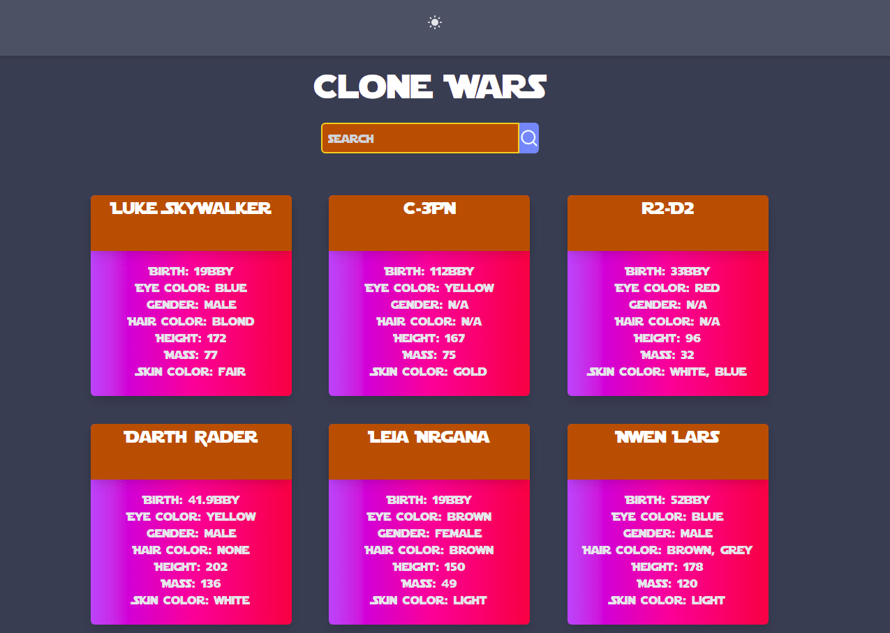

# Clone Wars

## 💻 Project

Clone Wars is a good way to search information about your favorite Star Wars Characters.
You can access the live application [Here][here].

<h1 align="center">
    
</h1>


## :rocket: Technologies

This project was developed with the following technologies:

- [React][reactjs]
- [TypeScript][typescript]
- [TailWindCSS][tailwindcss]
- [NextJS][nextjs]

## :information_source: How To Use

To clone and run this application, you'll need [Git](https://git-scm.com), [Node.js][nodejs] + [Yarn][yarn] installed on your computer.

From your command line:

### Installation

```bash
# Clone this repository
$ git clone https://github.com/sealove20/clone-wars

# Go into the repository
$ cd clone-wars

# Install dependencies
$ yarn install

# Start server
$ yarn dev

# running on port 3000
```

### Test

You can run the tests with the command:


```bash
$ yarn test
```

=)

[nextjs]: https://nextjs.org/
[tailwindcss]: https://tailwindcss.com/
[typescript]: https://www.typescriptlang.org/
[reactjs]: https://reactjs.org
[yarn]: https://yarnpkg.com/
[nodejs]: https://nodejs.org/
[here]: https://clone-wars-pb2jsyx77.vercel.app/
